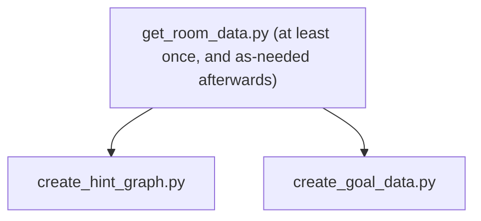

# AP Data Scripts

Some scripts to help me learn python. Used to look at Archipelago data

- [`get_room_data.py`](get_room_data.py) - Gets data for an Archipelago room and stores to json  
- [`create_hint_graph.py`](create_hint_graph.py) - Creates a hint graph from room data. Has a good number of options to show the data in different ways  
- [`create_goal_data.py`](create_goal_data.py) - Creates goal data json file from room data. Only supports some games

Typical order of how to run scripts


Run each python script with the `-h` or `--help` argument to see what you can do
```bash
python get_room_data.py -h
# A bunch of text will follow here detailing the arguments the script accepts
```

# Setup
### First time setup
```bash
# Linux only. Look up your specific package manager if you don't use apt
sudo apt install build-essential graphviz libgraphviz-dev

# Create a python virtual environment
python -m venv .venv

# Start the virtual environment
source .venv/bin/activate # bash
.\.venv\Scripts\Activate.ps1 # powershell

# Upgrade pip
pip install --upgrade pip

# Install python dependencies. Use the file that matches your OS
pip install -r requirements_linux.txt
pip install -r requirements_windows.txt
pip install -r requirements_macos.txt
```

### Every time you open a new terminal after the first time setup is complete
```bash
source .venv/bin/activate # bash
.\.venv\Scripts\Activate.ps1 # powershell
```
